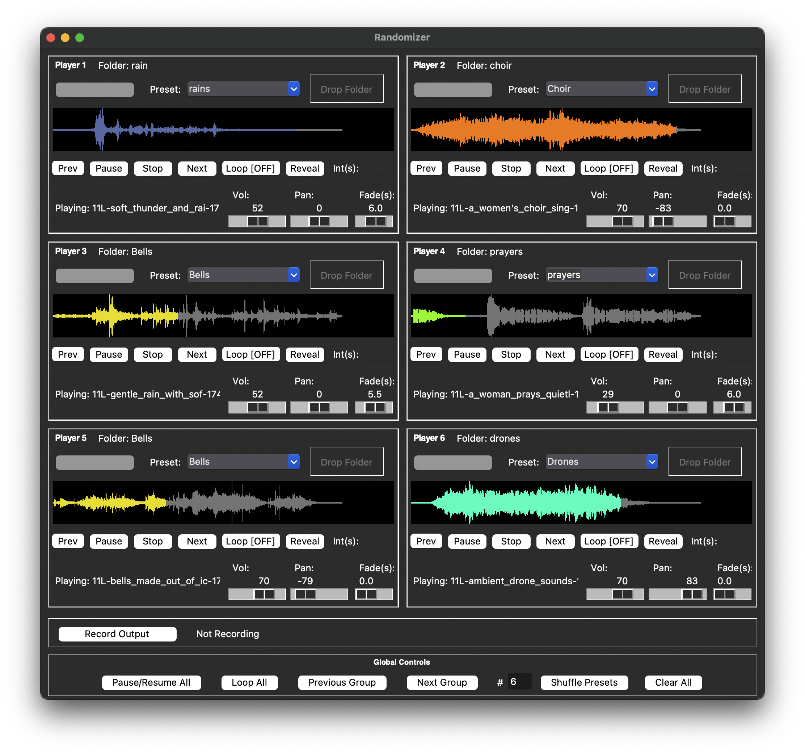

# Randomizer

Randomizer lets you generate dynamic soundscapes and ambient textures by simultaneously playing and randomly shuffling audio tracks from multiple folders. Control up to **6 independent players** arranged in a 3x2 grid, each with its own volume, panning, looping, **fade duration**, and timed track switching settings.

Key features include visual waveform display with customizable progress colors linked to presets, drag-and-drop folder loading, the ability to save/manage/rename/recolor presets, extensive global controls and hotkeys (pause, loop, next/prev group, shuffle count, clear all), and options to record the live audio output or export the current mix/stems to files.

Inspired by Brian Eno's "Shuffler" application and a desire to have something similar to play with.  





## Features

*   **Multi-Player Playback:** Load and play audio from up to **6 independent players** simultaneously.
*   **Randomized Track Selection:** Automatically shuffles through audio files within selected folders.
*   **Independent Player Controls:** Adjust volume, stereo panning, loop toggle, **fade duration (fade-in/fade-out)**, and track change interval for each player.
*   **Visual Waveform Display:** See a visual representation of the current track for each player.
*   **Customizable Waveform Colors:** Assign unique colors to the playback progress based on saved presets for easy identification.
*   **Preset Management:** Save frequently used folders (with their assigned colors) as presets. Load, manage, **rename**, and **change colors** of presets.
*   **Drag-and-Drop:** Easily load folders by dragging them onto the player interface.
*   **Global Controls & Hotkeys:**
    *   Pause/Resume All (Button & `Spacebar`)
    *   Toggle Loop All (Button & `l` key)
    *   Previous Group (Button & `[` key)
    *   Next Group (Button & `]` key)
    *   Shuffle Presets (Button & `Enter` in count box) with selectable player count (1-6).
    *   Stop & Clear All (Button)
*   **Audio Recording:** Record the mixed stereo output directly to a WAV file.
*   **Mix/Stem Export:** Export the current mix or individual player stems (last played track) as WAV files, with options for normalization.

## Requirements

*   Python 3.8 or higher (Developed and tested with Python 3.12)
*   External Libraries:
    *   Pygame (for audio playback)
    *   TkinterDnD2 (for drag-and-drop)
    *   NumPy (for audio data manipulation)
    *   SoundFile (for reading audio files)
    *   SoundDevice (for audio recording)
    *   Librosa (for audio resampling during export)

    See `requirements.txt` for specific versions if needed.

## Installation

1.  **Clone or Download:**
    *   Clone the repository: `git clone https://github.com/[YourUsername]/Randomizer.git` *(Replace with your actual URL)*
    *   Or, download the source code ZIP file from GitHub.
2.  **Navigate to Directory:**
    Open your terminal or command prompt and change to the directory where you cloned or extracted the files:
    `cd path/to/Randomizer`
3.  **Set up a Virtual Environment (Recommended):**
    ```bash
    python -m venv venv
    # On Windows
    .\venv\Scripts\activate
    # On macOS/Linux
    source venv/bin/activate
    ```
4.  **Install Dependencies:**
    ```bash
    pip install -r requirements.txt
    ```
## Basic Usage

1.  **Run the application:**
    ```bash
    python randomizer.py
    ```
2.  **Load Audio:**
    *   Click the "Select Folder" button for a player.
    *   Or, drag a folder containing audio files (WAV, MP3, OGG, FLAC) onto the "Drop Folder" area for a player.
3.  **Start Playback:**
    *   Click the "Play" button (▶️) for an individual player.
4.  **Adjust Controls:** Use the sliders for volume/pan/fade, set the interval timer, toggle loop, etc.
5.  **Explore!** Load different folders into other players, use presets, and experiment with the global controls and hotkeys.

## User Manual

### Interface Overview

Randomizer window is divided into several main sections:

1.  **Player Sections (x6):**
    *   The main area displays **6 independent players** arranged in a **3x2 grid** (3 rows, 2 columns).
    *   Each player has its own horizontal section containing:
        *   **Player Number:** Identifies the player (1-6).
        *   **Folder Display:** Shows the name of the currently loaded audio folder.
        *   **Select Folder Button:** Opens a dialog to choose an audio folder.
        *   **Preset Dropdown:** Allows selecting a saved folder preset.
        *   **Drop Folder Area:** Drag and drop an audio folder here to load it.
        *   **Waveform Display:** Shows a visual representation of the current track's waveform. The background is grey, and the filled-in part (showing playback progress) uses the color assigned to the preset (or a default green).
        *   **Control Buttons:**
            *   `Prev`: Go back to the previously played track.
            *   `Play`/`Pause`/`Resume`: Control playback state.
            *   `Stop`: Stop playback for this player.
            *   `Next`: Manually skip to the next random track (immediate).
            *   `Loop [ON/OFF]`: Toggle looping for the current track.
            *   `Reveal`: Show the currently playing file in your system's file explorer.
        *   **Interval Entry (`Int(s):`)**: Set the number of seconds before automatically switching to the next random track (only applies when Loop is OFF). Leave blank or set to 0 to play the full track (respecting fade-out).
        *   **Status Label:** Displays the current track name or status messages.
        *   **Volume Slider (`Vol:`):** Adjusts the volume for this player (0-100).
        *   **Pan Slider (`Pan:`):** Adjusts the stereo panning for this player (-100 Left to +100 Right).
        *   **Fade Slider (`Fade(s):`)**: Adjusts the fade-in and fade-out duration in seconds (0-10) for this player.

2.  **Global Controls Section:**
    *   Contains buttons and input for managing multiple players simultaneously.
    *   `Pause/Resume All`: Pauses/resumes all playing/paused players.
    *   `Toggle Loop All`: Toggles the loop state for all currently playing (not paused) players.
    *   `Previous Group`: Triggers the "Prev" button for all currently playing (not paused) players.
    *   `Next Group`: Triggers the "Next" button (immediate skip) for all currently playing (not paused) players.
    *   **Shuffle Count Entry (`#:`):** Enter the number of players (1-6) to affect with the "Shuffle Presets" button. Defaults to all (6).
    *   `Shuffle Presets`: Loads a randomly selected preset into the specified number of players, clearing the others.
    *   `Clear All`: Stops playback and clears all data/settings for all players.

3.  **Recording Section:**
    *   `Record Output Button`: Starts or stops recording the mixed stereo output to a WAV file.
    *   **Status Label:** Shows recording status and output filename.

4.  **Menu Bar (Top of Window):**
    *   **File:** Options for exporting the mix or stems, and exiting the application.
    *   **Presets:** Options to save the current folder for a player as a preset, and manage existing presets (view/delete/**rename**/**change color**).
    *   **Settings:** Configure application settings, such as the audio input device used for recording.

**Hotkeys:**

*   `Spacebar`: Toggle Pause/Resume All
*   `l`: Toggle Loop All
*   `[`: Previous Group
*   `]`: Next Group
*   `Enter` (when focus is on Shuffle Count box): Trigger Shuffle Presets

### Loading Audio

There are two ways to load audio files into a player:

1.  **Select Folder Button:**
    *   Click the `Select Folder` button located next to the player number.
    *   A system dialog will appear, allowing you to navigate to and select the folder containing the audio files you want to use for that player.
    *   Once selected, the player will scan the folder for compatible audio files and display the folder name.

2.  **Drag and Drop:**
    *   Open your system's file explorer (Finder on macOS, File Explorer on Windows).
    *   Locate the folder containing the audio files you want to use.
    *   Click and drag the folder icon directly onto the rectangular area labeled `Drop Folder` within the desired player's section.
    *   Release the mouse button. The player will then load the audio files from that folder.

**Supported Audio Formats:**

The application primarily relies on Pygame for playback and should support common formats like:

*   `WAV` (Uncompressed, generally most reliable)
*   `MP3`
*   `OGG`
*   `FLAC` (May require system libraries or specific Pygame builds)
*   `AIF`
*   `AIFF`

*Note: Compatibility with specific formats like MP3 or FLAC might depend slightly on your operating system and the specific version of Pygame and its underlying SDL_mixer library.*

**After Loading:**

Once a folder is loaded, the player is ready. Playback will typically start automatically with a random track from the folder. If playback doesn't start, ensure the folder contains supported audio files and click the player's `Play` button.

### Playback Controls

Each player has a set of buttons, sliders, and an entry field to control how audio tracks are played:

*   **Play/Pause/Resume Button:**
    *   Controls the playback state (Play, Pause, Resume). Handles fade-in when starting.

*   **Stop Button:**
    *   Stops playback completely for this player. Handles fade-out based on the Fade slider setting.

*   **Previous Button:**
    *   Stops the current track (handling fade-out) and plays the *previously* played track in this player's history.

*   **Next Button:**
    *   **Immediately** stops the current track (ignoring fade-out) and plays the *next* randomly selected track from the folder.

*   **Loop Button (`Loop [ON/OFF]`):**
    *   Toggles looping for the currently playing track. When OFF, automatic transitions (interval or natural end) occur.

*   **Reveal Button:**
    *   Opens your system's file explorer and highlights the currently playing audio file.

*   **Interval Entry (`Int(s):`)**
    *   Sets a timer (in seconds) for automatically switching tracks when Loop is OFF.
    *   Enter a number (e.g., `30`). The player will automatically start fading out (if fade > 0) or switch immediately (if fade = 0) after this many seconds.
    *   If empty, `0`, or non-numeric, the player plays the *entire* track, initiating fade-out (if fade > 0) before the natural end.

*   **Fade Slider (`Fade(s):`)**
    *   Sets the duration (0.0 to 10.0 seconds) for both fade-in and fade-out.
    *   **Fade-In:** Applied automatically when a track starts playing.
    *   **Fade-Out:** Applied automatically when stopping (Stop button), playing the previous track (Prev button), or when an automatic transition occurs (Interval timer or natural end of track). *Note: Fade-out is bypassed by the manual Next button.*
    *   A value of `0.0` disables fades.

### Volume and Panning

Each player has dedicated sliders to control its audio output level and stereo position:

*   **Volume Slider (`Vol:`):**
    *   Located below the status label.
    *   Controls the loudness of the player.
    *   The range is from `0` (silent) to `100` (maximum volume for that player).
    *   Adjust the slider by clicking and dragging the handle.

*   **Pan Slider (`Pan:`):**
    *   Located next to the volume slider.
    *   Controls the stereo positioning of the player's audio.
    *   The range is from `-100` (hard left) to `+100` (hard right).
    *   A value of `0` positions the audio directly in the center.
    *   Adjust the slider by clicking and dragging the handle.

### Presets

Presets allow you to save frequently used audio folders along with a custom waveform color for quick access.

*   **Saving a Preset:**
    1.  Load an audio folder into a player.
    2.  Go to the `Presets` menu in the top menu bar.
    3.  Select `Save Player [1-6]'s Folder as Preset...`.
    4.  Enter a name for your preset and click `OK`.
    5.  Choose a color using the color chooser dialog and click `OK`.
    6.  The preset (folder path and chosen color) is now saved.

*   **Loading a Preset:**
    1.  Click the dropdown menu next to the `Select Folder` button in the desired player's section.
    2.  Select the name of the saved preset from the list.
    3.  The associated folder will be loaded, and the waveform progress will use the preset's color.

*   **Managing Presets:**
    1.  Go to the `Presets` menu and select `Manage Presets...`.
    2.  A dialog box appears listing all saved presets. The background color of each item reflects its assigned color.
    3.  Select a preset in the list.
    4.  Click `Rename` to enter a new name for the selected preset.
    5.  Click `Change Color` to choose a new color for the selected preset.
    6.  Click `Delete` to remove the selected preset permanently.
    7.  Click `Close` when finished.

*   **Preset File:**
    *   Presets are saved in `player_presets.json` in the application directory. Manual editing is possible but requires care with JSON formatting.

### Waveform Display

Each player features a waveform display area that provides a visual overview of the currently loaded audio track:

*   **Appearance:** The display shows a simplified representation of the track's amplitude over time.
*   **Background:** The background or "unplayed" portion of the waveform is drawn in a neutral grey color (`grey50`).
*   **Progress Color:** As the track plays, the waveform fills in from left to right. The color used for this filled-in "progress" section depends on how the folder was loaded:
    *   **Preset Loaded:** If the audio folder was loaded using a saved preset, the progress color will be the custom color you assigned to that preset. This helps visually identify the source or category of the sound.
    *   **Folder Loaded Directly:** If the folder was loaded using the `Select Folder` button or drag-and-drop (and it doesn't match a saved preset path), the progress color will be the default light green (`#90EE90`).
*   **Purpose:** The waveform gives you a quick visual cue about the structure of the current track (e.g., loud vs. quiet parts) and shows the current playback position.

### Global Controls

Located below the player sections, the Global Controls provide buttons and input to manage multiple players simultaneously:

*   **Pause/Resume All Button:** Pauses all playing players or resumes all paused players. (Hotkey: `Spacebar`)
*   **Toggle Loop All Button:** Toggles the loop state (`ON` or `OFF`) for all players that are currently playing (not paused). The button text turns red if any active player is looping. (Hotkey: `l`)
*   **Previous Group Button:** Triggers the `Prev` action (play the previous track, handling fade-out) for all players that are currently playing (not paused). (Hotkey: `[`)
*   **Next Group Button:** Triggers the `Next` action (**immediate** skip, ignoring fade-out) for all players that are currently playing (not paused). (Hotkey: `]`)
*   **Shuffle Count Entry (`#:`):** Enter the number of players (1-6) you want the `Shuffle Presets` button to affect. If left blank, invalid, or out of range, it defaults to all 6 players. (Hotkey: `Enter` triggers Shuffle Presets when this box has focus).
*   **Shuffle Presets Button:** Loads a randomly selected preset into the specified number of players (from the Count Entry), clearing any remaining players. Requires saved presets to function.
*   **Clear All Button:** Stops playback immediately (handling fade-out) and clears all loaded folders, presets, and settings for all players, returning them to their initial state.

### Recording

Randomizer allows you to record the combined stereo audio output of all players directly to a file:

*   **Record Output Button:**
    *   Located in the "Recording" section at the bottom of the window.
    *   Clicking this button when *not* recording will prompt you to choose a location and filename for your recording. The file will be saved in `WAV` format. Recording starts immediately after you confirm the filename.
    *   Clicking this button when *already* recording will stop the recording process and finalize the WAV file.

*   **Status Label:**
    *   Displays the current recording status.
    *   When idle, it shows "Not Recording".
    *   When recording is active, it shows "Recording: ON" and the full path to the output WAV file being written.

*   **Audio Source:**
    *   The recording captures the mixed stereo output of all players *after* their individual volume and panning settings have been applied.
    *   It typically records what you hear through your default system output. The specific audio input device used for recording can be configured via the `Settings -> Audio Settings...` menu option.

### Exporting

The application provides options to export the current audio state as WAV files, accessible via the `File` menu:

*   **Export Mix... (`File` -> `Export Mix...`)**
    *   This option renders the audio from the *last track played or currently playing* in each active player, applies their current volume and panning settings, and mixes them together into a single stereo WAV file.
    *   You will be prompted to choose a save location and filename.
    *   A dialog will ask for you to set the desired **fade-in** and **fade-out** time in seconds. 
        
        
*   **Export Stems... (`File` -> `Export Stems...`)**
    *   This option renders the audio from the *last track played or currently playing* in each active player as *separate* WAV files. Great for additional processing of the separate tracks in a DAW, if interested.
    *   Volume and panning settings are **ignored** for stem export; each stem represents the original audio file's content for the respective player.
    *   You will be prompted to choose a *folder* where the stems will be saved.
    *   The files will be automatically named based on the player number and the original track filename (e.g., `Player1_trackname.wav`, `Player2_another.wav`, etc.).
    
    
**Important Notes on Exporting:**

*   Exporting uses the *last track* associated with each player. If a player hasn't played anything yet or is stopped without a history, it won't contribute to the export.
*   The export process reads and processes the audio files directly; it's not a real-time recording.
*   The output format for both mix and stems is always WAV.

### Configuration (`config.json`)

Some application behaviors can be customized by editing the `config.json` file, which is located in the same directory as the application script (`randomizer.py`). If this file doesn't exist, the application will use default values.

*   **Location:** Same directory as `randomizer.py`.
*   **Format:** JSON (JavaScript Object Notation). Be careful with syntax (curly braces `{}`, quotes `""` around keys and string values, commas `,` between entries).

**Current Settings:**

*   `"default_volume"`: (Number between 0.0 and 1.0) Sets the initial volume level for players when the application starts. Example: `"default_volume": 0.75`.
*   `"default_recording_path"`: (String) Specifies the default directory where the application will suggest saving recordings. Example: `"default_recording_path": "/Users/YourName/Music/Recordings"`.
*   `"input_device_index"`: (Integer or `null`) Specifies the index of the audio input device to use for recording. `null` usually means the system's default input device. Find available device indices using the `Settings -> Audio Settings...` menu option. Example: `"input_device_index": 1`.

**Example `config.json`:**

```json
{
  "default_volume": 0.8,
  "default_recording_path": "",
  "input_device_index": null
}
```


### License & Acknowledgments


#### License

This project is licensed under the MIT License - see the LICENSE file for details.

#### Acknowledgments

*   Inspired by the generative music concepts explored by Brian Eno. See [this interview ](https://youtu.be/nR4JAonAR4g?si=ExNafUZfrCR7IhRq) for reference.

*   Uses several fantastic open-source libraries including Pygame, TkinterDnD2, NumPy, SoundFile, SoundDevice, and Librosa.

